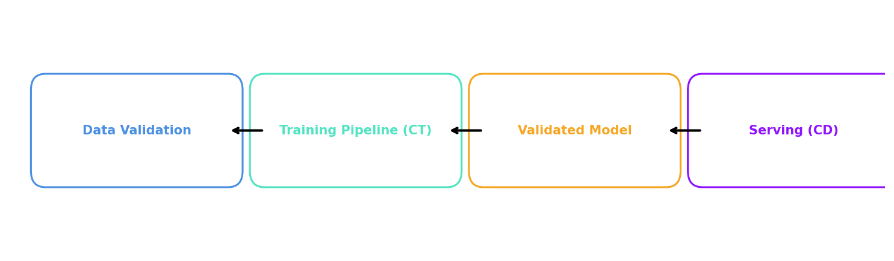

# PdM MLOps Pipeline (TFX + Docker)

This project implements a **Predictive Maintenance (PdM) Machine Learning pipeline** using **TensorFlow Extended (TFX)** and a **Level 2 MLOps architecture** with Docker.  

The pipeline covers:
- ✅ Data validation (CSV + pandas)
- ✅ Preprocessing and feature engineering
- ✅ Model training
- ✅ Model validation
- ✅ Model export for serving

---

## 📂 Project Structure

.

├── data/ # Input datasets (CSVs)

├── models/ # Exported models (output artifacts)

├── tfx_pipeline/ # TFX pipeline definition

│ ├── pipeline.py # Pipeline entry point

│ ├── components.py # Custom components

├── pyproject.toml # Project dependencies

├──src/model_core/

│ ├── feature_dev.py # feature transformation logic in pandas

│ ├── model_train_func.py # model training process

├── uv.lock Lockfile

└── Dockerfile # Docker image definition


---

## ⚙️ Requirements

- [Docker](https://docs.docker.com/get-docker/)  
- (Optional) Python 3.9+ and [uv](https://github.com/astral-sh/uv) if you want to run locally without Docker  

---

## 🛠 Build the Docker Image

From the project root:

```bash
docker build -t pdm-tfx-pipeline:latest .


▶️ Run the Batch Pipeline

Mount data/ (input datasets) and models/ (pipeline outputs) from the host:

docker run --rm -it \
  -v $(pwd)/data:/app/data \
  -v $(pwd)/models:/app/models \
  pdm-tfx-pipeline:latest


This will run the pipeline steps:

Data Validation

Training Pipeline (Continuous Training)

Model Evaluation & Validation

Export of the validated model → ./models/

📦 Outputs

Pipeline artifacts (trained models, metrics, transformations) are stored in ./models.

Each run produces snapshots / versions for traceability.

🏗 MLOps Architecture (Level 2)

The project follows a simplified CT + CD lifecycle:

Data Validated → Training Pipeline (CT) → Validated Model → Serving (CD)


CT (Continuous Training): Each pipeline run validates input data, trains, and versions models.

CD (Continuous Delivery): The validated model is exported and ready to be deployed in a serving container.


🧪 Development & Debugging

To open a shell inside the container:

docker run --rm -it pdm-tfx-pipeline:latest /bin/bash

🚀 Next Steps

Implement a serving container (FastAPI or TFX Serving) that loads latest_model from ./models.

Orchestrate with Airflow / Kubeflow for scheduled retraining.

Integrate an experiment tracker (MLflow, Vertex AI, etc.) for full lineage and monitoring.

```

