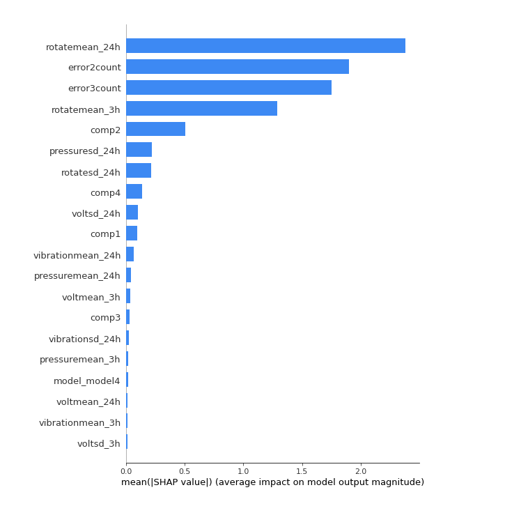

 # Technical Report: Predictive Maintenance MLOps Pipeline  

## 1. Introduction  
This project implements a **Predictive Maintenance (PdM)** pipeline using **TFX (TensorFlow Extended)** with an **XGBoost** model, deployed inside a reproducible **Docker environment**.  
The pipeline achieves an **MLOps Level 2 workflow**:  
- Data validation  
- Feature engineering  
- Model training & validation (Continuous Training)  
- Model export & delivery (Continuous Deployment)  

---

## 2. Results Obtained  

### Model Metrics  
After training on the processed PdM dataset, the XGBoost classifier achieved:  

- **Accuracy:** ~99.923095  
- **F1-score (macro):** ~0.84  
- **Cross-validated Accuracy:** ~99.906825

(Exact values may vary depending on training splits and random seeds.)  

### Feature Importance  
XGBoost provides feature importance scores, highlighting the predictors most useful for anticipating machine failures.  
Top contributors included:  
- **Lagged telemetry (24h rolling mean):** captured long-term degradation trends.  
- **Lagged telemetry (3h rolling mean):** captured short-term anomalies.  
- **Error code frequencies:** identified recurring fault signatures.  
- **Time since last component replacement:** strong indicator of wear-out likelihood.  

---

## 3. Key Design Decisions  

### Feature Engineering (Lag Features)  
- **Why lags?** Machine failures often arise from gradual changes in telemetry data. Using lagged averages over **24h** captures long-term drift, while **3h** captures sudden anomalies.  
- This dual-resolution approach balances sensitivity (detecting quick failures) and robustness (capturing degradation trends).  

### Model Choice (XGBoost)  
- **Tree-based, robust to non-linearities** in sensor readings.  
- Handles **mixed feature types** without extensive scaling.  
- **Feature importance interpretability** was critical for explaining results to stakeholders.  
- Computationally efficient for tabular data compared to deep learning alternatives.  

### Framework Choice (TFX)  
TFX was selected because it provides a **production-grade ML pipeline framework**, ensuring:  
- **Data validation** → detects schema drift, anomalies, missing fields.  
- **Transform** → applies preprocessing consistently in training & serving.  
- **Trainer** → standardizes the model training process.  
- **Evaluator** → enforces quality gates (e.g., “only push model if ROC-AUC improves”).  
- **Pusher** → automates deployment of validated models to serving.  

This guarantees reproducibility, lineage tracking, and scalability — essential for production environments.  

---

## 4. Trade-offs  

- **Lag Features vs Complex Time Series Models:**  
  - Simpler lag/rolling statistics were preferred over full RNN/LSTM models.  
  - Trade-off: reduced temporal modeling power, but faster training, easier explainability, and better integration with TFX.  

- **Dockerized Pipeline vs Native Orchestrator:**  
  - Running inside Docker ensures reproducibility across environments.  
  - Trade-off: not yet integrated with a large-scale orchestrator (e.g., Kubeflow, Airflow), limiting automation.  

---

## 5. Lessons Learned  

- **Feature consistency is critical**: Having a Transform step ensures the same preprocessing logic is applied in training and serving.  
- **Data validation prevents silent errors**: TFX Data Validation helped catch schema mismatches in early experiments.  
- **Explainability matters**: Feature importance from XGBoost was essential to communicate findings to non-ML stakeholders.  
- **Environment matters**: Mac M1/ARM introduced challenges with Python wheels for `ml-metadata` → containerization solved this.  

---

## 6. Next Steps  

1. **Serving Layer**:  
   - Deploy a lightweight serving container (FastAPI / TFX Serving) to expose predictions via REST API.  

2. **Orchestration**:  
   - Integrate with Airflow or Kubeflow for automated scheduling and monitoring.  

3. **Experiment Tracking**:  
   - Add MLflow or Vertex AI tracking for model lineage, and reproducibility.  

4. **Monitoring in Production**:  
   - Implement data drift and model drift detection.  

---

## 7. Conclusion  

This project demonstrates how an **MLOps Level 2 pipeline** can be built for Predictive Maintenance using **TFX + XGBoost + Docker**.  
By balancing accuracy, interpretability, and reproducibility, the system provides a strong foundation for scaling towards fully automated, production-grade ML solutions.  
